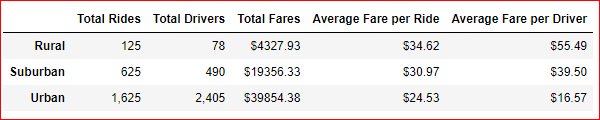
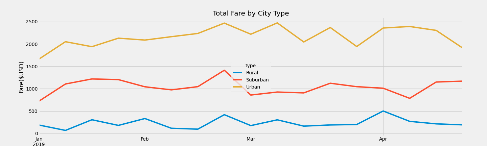

# PyBer_Analysis

## Overview of Analysis
* Using the city data & ride date, create DataFrame of the ride-sharing data by city type.
* Create multiple-line graph for the total weekly fares for each city type.

## Ride-sharing summary DataFrame by city type:
* Read the ride data & city data into the data frame.
* Merged the ride data & city data to create a new dataframe.
* Retrieved the total number of rides by city type by using the 'groupby' on the city type.
* Retrieved the total number of drivers for each city type from City data file.
* Retrieved the sum of fares by city type.
* The "average fare per ride" was calculated by dividing the total fare by total number of rides.
* The "average fare by driver" for each city type was calculated by dividing the total fare by number of drivers.
* Created and formatted new data frame with the above data as shown below:

## Created a multiple line plot showing the total weekly fares for each type of city:
* Created a dataframe for the sum of fares for each date ,using 'groupby' function with two indices city type and date.
* Reset the index on the dataframe using the 'reset_index' function.
* Changed the data type of date from object to datetime object using the datetime function.
* Created pivot table with date as index, type for columns, fares for values.
* Converted the date index into date type.
* Created new dataframe by using the 'resample' function by week and got the sum of the fares for each week.
* Created the multiple line graph for each city type using the object-oriented method as shown below.

## Result of the analysis:
* The urban city has lower average fare compared to suburban & rural cities.
* The total number of rides in the urban city is relatively higher compared to suburban & rural cities.
* The average fare per ride & per driver is relatively more for the rural city.

## Summary
 1. Based on the data & analysis , the number of drivers in urban city is more than the number of rides (1625 rides vs 2405 drivers), implying the 800 drivers are idle. 
   In rural & suburban cities, the number of rides is more than the number of drivers, implying the drivers are not idle. To address this disparity, we can recommend to CEO to    allocate the idle drivers to suburban or rural cities.  
 2. The "average fare per drivers" in rural city is more compared to urban city ($55 vs $17). 
    To address this disparity, we can recommend to CEO to allocate urban city drivers to rural cities. 
    Above two are the disparities from drivers' side. 
 3. The rural city "average fares per driver" is more compared to urban and suburban cities. Werecommend that the CEO to allocate urban/suburban drivers to rural cities. 
  
  
  

